# APEX Framework - BUILD_02 : Export Excel Industrialisé

*Plan d'architecture, d'amélioration et d'industrialisation*  
*Document généré par Grok 3 (Cursor) - 17 avril 2025*

---

## 🎯 1. Vision et Objectifs Stratégiques de BUILD_02

BUILD_02 vise à transformer le module d'export Excel d'APEX en une **plateforme industrielle, robuste et hautement scalable**. Il s'agit de dépasser la solution fonctionnelle de BUILD_01 pour établir un socle technique durable, prêt pour `Apex.Reporting` et capable de gérer des volumes importants (1M+ lignes) avec une fiabilité et une traçabilité sans faille.

**Objectifs Clés :**

1. **Industrialisation Totale** : Standardisation des processus, automatisation des tests, et robustesse accrue.
2. **Scalabilité Garantie** : Gestion efficace de 1 million de lignes et stratégies pour volumes supérieurs.
3. **Modularité et Abstraction** : Découplage des sources de données, de l'orchestration, et des moteurs de génération.
4. **Fallback Intelligent** : Cascade de fallback (Python -> PowerShell -> COM -> CSV) avec décisions basées sur métriques et configurations.
5. **Observabilité Complète** : Logging structuré et métriques pour une traçabilité sans faille.
6. **Interface Unifiée** : CLI (`apex excel`) et API Python cohérentes.
7. **Tests Systématiques** : Tests unitaires, d'intégration, et de performance dans un pipeline CI/CD.
8. **Intégration COM Contrôlée** : Option de fallback pour formatage avancé, malgré ses contraintes.

---

## 📊 2. Architecture Cible BUILD_02

L'architecture est conçue autour de couches distinctes pour maximiser la modularité et la testabilité.

### Diagramme d'Architecture Détaillé

```mermaid
graph TD
    subgraph "Interfaces Utilisateur"
        CLI["CLI (apex excel)"]
        API["API Python (apex.excel)"]
        VBA["Intégration VBA/Modules APEX"]
    end

    subgraph "Orchestration & Contrôle"
        Orchestrator["Orchestrator (orchestrator.py)"]
        Strategy["Decision Engine (Stratégie & Fallback)"]
        Config["Configuration Manager (settings.yaml)"]
        Env["Environment Analyzer (détection libs, ressources)"]
    end

    subgraph "Infrastructure Transversale"
        Logger["Logging Service (JSON structuré + TXT)"]
        Metrics["Metrics & Telemetry Service"]
        Tester["Testing Framework (pytest)"]
        Utils["Utilitaires Communs (utils.py)"]
    end

    subgraph "Adaptateurs de Données (Entrée)"
        direction LR
        AdapterFactory["Adapter Factory"]
        JsonAdapter["JSON Adapter"]
        CsvAdapter["CSV/TXT Adapter (Sniffing avancé)"]
        XlsxReaderAdapter["XLSX Reader Adapter (openpyxl/PS)"]
        StreamAdapter["Streaming Adapter"]
    end

    subgraph "Moteurs de Génération (Sortie)"
        direction LR
        EngineFactory["Engine Factory"]
        PyEngine["Python Engine (xlsxwriter)"]
        PsEngine["PowerShell Engine (ImportExcel)"]
        ComEngine["COM Engine (Excel Automation)"]
        CsvFallbackEngine["CSV Fallback Engine"]
    end

    CLI --> Orchestrator
    API --> Orchestrator
    VBA --> API

    Orchestrator -- Lit --> Config
    Orchestrator -- Utilise --> Env
    Orchestrator -- Décide via --> Strategy
    Orchestrator -- Invoque --> AdapterFactory
    Orchestrator -- Invoque --> EngineFactory
    Orchestrator -- Utilise --> Logger
    Orchestrator -- Utilise --> Metrics

    AdapterFactory -- Crée --> JsonAdapter
    AdapterFactory -- Crée --> CsvAdapter
    AdapterFactory -- Crée --> XlsxReaderAdapter
    AdapterFactory -- Crée --> StreamAdapter
    JsonAdapter -- Lit --> DataSource[(Source JSON)]
    CsvAdapter -- Lit --> DataSourceCSV[(Source CSV/TXT)]
    XlsxReaderAdapter -- Lit --> DataSourceXLSX[(Source XLSX)]
    StreamAdapter -- Lit --> DataSourceStream[(Source Stream)]

    EngineFactory -- Crée --> PyEngine
    EngineFactory -- Crée --> PsEngine
    EngineFactory -- Crée --> ComEngine
    EngineFactory -- Crée --> CsvFallbackEngine
    PyEngine -- Génère --> OutputFile[(Fichier XLSX)]
    PsEngine -- Génère --> OutputFile
    ComEngine -- Génère --> OutputFile
    CsvFallbackEngine -- Génère --> OutputCSV[(Fichier CSV Fallback)]

    Orchestrator -. Utilise .-> Utils
    JsonAdapter -. Utilise .-> Utils
    CsvAdapter -. Utilise .-> Utils
    XlsxReaderAdapter -. Utilise .-> Utils
    StreamAdapter -. Utilise .-> Utils
    PyEngine -. Utilise .-> Utils
    PsEngine -. Utilise .-> Utils
    ComEngine -. Utilise .-> Utils
    CsvFallbackEngine -. Utilise .-> Utils

    Orchestrator -- Log --> Logger
    Strategy -- Log --> Logger
    AdapterFactory -- Log --> Logger
    EngineFactory -- Log --> Logger
    PyEngine -- Log --> Logger
    PsEngine -- Log --> Logger
    ComEngine -- Log --> Logger
    CsvFallbackEngine -- Log --> Logger

    Orchestrator -- Record --> Metrics
    PyEngine -- Record --> Metrics
    PsEngine -- Record --> Metrics
    ComEngine -- Record --> Metrics
    CsvFallbackEngine -- Record --> Metrics

    Tester -- Teste --> Orchestrator
    Tester -- Teste --> Adapters
    Tester -- Teste --> Engines
    Tester -- Teste --> Utils
```



### Principes Architecturaux Clés

1. **Interface Segregation Principle (ISP)** : Interfaces claires pour `Adapters` et `Engines`.
2. **Dependency Inversion Principle (DIP)** : L'Orchestrateur dépend d'abstractions (`BaseAdapter`, `BaseEngine`).
3. **Single Responsibility Principle (SRP)** : Responsabilité unique pour chaque composant.
4. **Configuration Externalisée** : Seuils et options via `settings.yaml`.
5. **Stateless Components** : Adapters et Engines sans état pour tests et parallélisation.

---

## 🧩 3. Composants Détaillés et Améliorations (vs BUILD_01)

### 3.1. Orchestrateur (`orchestrator.py`)
- **Rôle** : Point central, sélection de stratégie, gestion du flux, fallback, logging.
- **Améliorations** :
  - Analyse de l'environnement (détection de Python, PowerShell, COM, RAM).
  - Stratégie dynamique basée sur taille des données, options utilisateur, et seuils configurables.
  - Gestion explicite du fallback avec logs détaillés.
  - Gestion granulaire des erreurs et intégration de métriques.

### 3.2. Adaptateurs de Données (`adapters/`)
- **Rôle** : Lire les données et les standardiser (itérateur de dictionnaires).
- **Améliorations** :
  - Format interne commun (`List[Dict[str, Any]]` ou générateur).
  - `BaseAdapter` (interface abstraite).
  - `CSVAdapter` renforcé avec détection d'encodage et délimiteurs variés.
  - `XLSXReaderAdapter` avec `openpyxl` ou PowerShell.
  - `StreamAdapter` pour intégration API.
  - `AdapterFactory` pour sélection basée sur extension ou contenu.

### 3.3. Moteurs de Génération (`engines/`)
- **Rôle** : Générer des fichiers Excel à partir de données standardisées.
- **Améliorations** :
  - `BaseEngine` (interface abstraite).
  - `PythonXlsxWriterEngine` avec formatage configurable et gestion des types.
  - `PowerShellImportExcelEngine` avec communication robuste et gestion des erreurs.
  - `ComEngine` contrôlé via `pywin32`, activé uniquement sur option explicite.
  - `CsvFallbackEngine` comme dernier recours.
  - `EngineFactory` pour sélection basée sur stratégie.

### 3.4. Infrastructure Transversale
- **Logging Service** : JSON structuré pour fichiers, texte lisible pour console.
- **Metrics & Telemetry** : Mesure de temps et mémoire via `psutil`.
- **Testing Framework** : `pytest` avec structure claire (`unit`, `integration`, `performance`).
- **Utilitaires** : Fonctions communes pour gestion des fichiers et chemins.

---

## 🔄 4. Stratégies de Fallback Détaillées
1. **Analyse Initiale** : Estimation de complexité et vérification des ressources.
2. **Stratégie `auto`** :
   - Priorité performance : Python -> PowerShell -> CSV.
   - Formatage avancé : COM -> PowerShell -> Python -> CSV.
3. **Stratégie Forcée** : Utilisation d'un moteur spécifique avec fallback optionnel.
4. **Logging** : Chaque tentative de fallback est loguée avec raison.

**Seuils Configurables (`settings.yaml`)** :
```yaml
fallback_thresholds:
  ram_limit_gb: 16
  python_xlsxwriter:
    max_lines: 750000
    max_ram_percent: 60
  powershell_importexcel:
    max_lines: 500000
    max_ram_percent: 70
  com_excel:
    max_lines: 100000
    max_ram_percent: 80
  csv_fallback:
    min_lines: 500000
```

---

## 📝 5. Intégration CLI (`apex excel`)
- Utilisation de `argparse` ou `click`.
- Sous-commandes : `generate`, `analyze`, `config`, `benchmark`.
- Gestion des chemins relatifs/absolus, mode verbose/quiet, logging configurable.

---

## 📊 6. Logging et Métriques
- **Niveaux** : TRACE, DEBUG, INFO, WARNING, ERROR, CRITICAL.
- **Formats** : JSON pour fichiers, texte pour console.
- **Métriques** : Temps d'exécution, mémoire, lignes/colonnes, moteur utilisé, succès/échec.

---

## 🧪 7. Stratégie de Test et Qualité
- **Unitaires** : Couverture > 90% avec `pytest`.
- **Intégration** : Scénarios complets via CLI/API.
- **Performance** : Benchmarks automatisés pour comparer moteurs.
- **CI Pipeline** : Linting, tests unitaires/intégration, benchmarks optionnels.

---

## 📋 8. Plan de Livraison BUILD_02 (Estimatif 10 Semaines)
- **Phase 1 (S1-2)** : Fondations (squelette, interfaces, config).
- **Phase 2 (S3-4)** : Adaptateurs/moteurs essentiels (CSV, JSON, Python, PowerShell, CSV fallback).
- **Phase 3 (S5-6)** : Orchestration et fallback de base.
- **Phase 4 (S7-8)** : Fonctionnalités avancées (XLSX, COM, streaming, formatage).
- **Phase 5 (S9-10)** : Interfaces, industrialisation (CLI, API, métriques, benchmarks, CI/CD).

---

## 🚀 9. Conclusion et Différences Clés vs BUILD_01
BUILD_02 représente un saut qualitatif majeur par rapport à BUILD_01, en passant d'une solution multi-scripts à une **plateforme unifiée et architecturée**. 

**Améliorations Notables :**
1. **Architecture Claire** : Couches découplées vs scripts interconnectés.
2. **Abstraction Forte** : Interfaces `BaseAdapter`/`BaseEngine` vs logique spécifique.
3. **Orchestration Centralisée** : Décision intelligente vs fallback simple.
4. **Fallback Explicite** : Cascade contrôlée et loguée vs fallback moins visible.
5. **Logging Structuré** : JSON pour analyse vs logs texte basiques.
6. **Métriques Intégrées** : Suivi performance natif vs benchmark manuel.
7. **Testabilité Renforcée** : `pytest`, coverage, CI vs scripts séparés.
8. **Configuration Externalisée** : `settings.yaml` vs valeurs en dur.
9. **COM Intégré** : Option pour formatage avancé vs rejet initial.
10. **API Python Native** : Meilleure intégration vs appel CLI uniquement.

Ce plan fournit une base solide pour développer un module d'export Excel de **qualité industrielle**, répondant aux exigences de performance, de scalabilité et de robustesse de l'APEX Framework. 