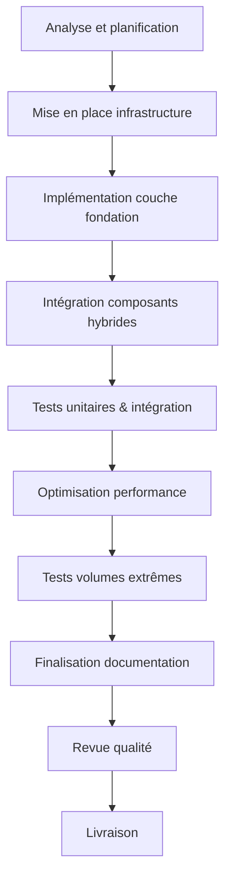
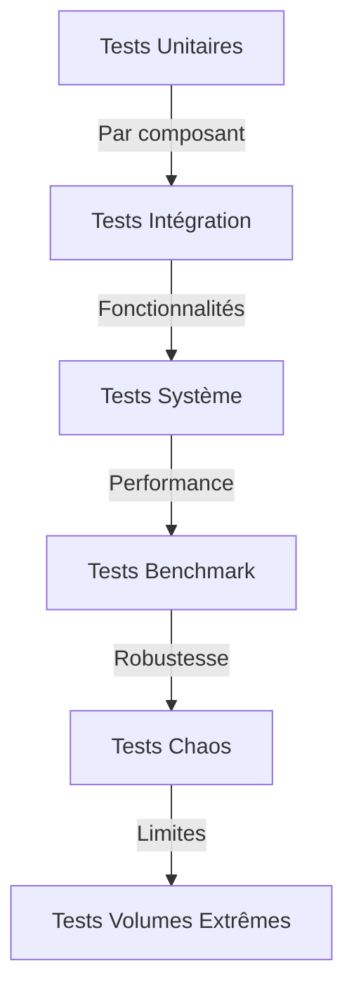
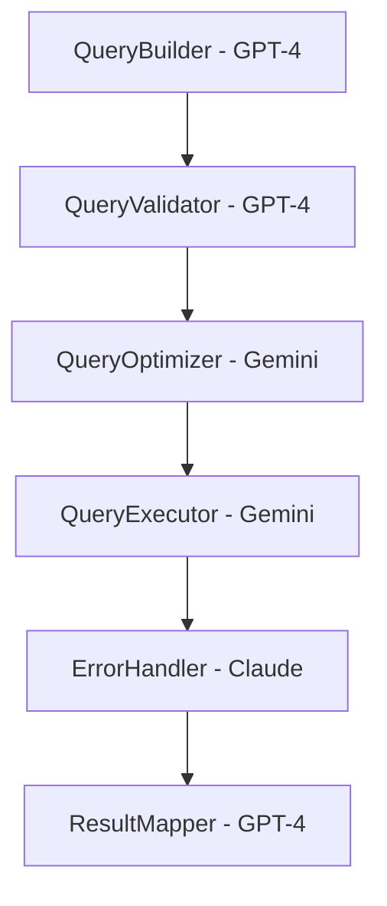

# Guide d'Implémentation d'Hybridation

## 1. Introduction

Ce document présente un guide pratique pour l'implémentation des solutions hybrides dans le cadre du framework APEX, basé sur l'expérience réussie du module `data_comparator`. Il fournit une méthodologie systématique, des patterns d'implémentation et des bonnes pratiques pour maximiser les bénéfices de l'hybridation.

### 1.1 Objectif du Guide

Ce guide vise à:
- Standardiser l'approche d'hybridation dans le framework APEX
- Accélérer l'implémentation des solutions hybrides
- Minimiser les risques d'intégration
- Garantir un niveau élevé de qualité et maintenabilité
- Capitaliser sur l'expérience acquise

### 1.2 Public Cible

Ce guide s'adresse aux:
- Architectes responsables de la conception hybride
- Développeurs chargés de l'implémentation
- Testeurs validant les solutions hybrides
- Responsables techniques supervisant le processus

## 2. Principes Fondamentaux d'Hybridation

### 2.1 Principes Directeurs

L'implémentation hybride doit respecter ces principes:

1. **Préserver l'architecture** - Maintenir la séparation des responsabilités
2. **Adapter localement** - Modifier uniquement les composants nécessaires
3. **Tester continuellement** - Valider chaque changement incrémental
4. **Documenter les choix** - Tracer les décisions et justifications
5. **Privilégier la maintenabilité** - Balance optimale performance/lisibilité

### 2.2 Prérequis Techniques

Avant d'entamer l'hybridation:

- Environnement de développement isolé
- Branches de code dédiées
- Suite de tests complète pour chaque implémentation source
- Métriques de performance de référence
- Documentation technique des implémentations d'origine

## 3. Processus d'Implémentation

### 3.1 Workflow d'Hybridation



### 3.2 Étapes Détaillées

#### 3.2.1 Préparation (1-2 semaines)

1. **Configuration environnement**
   - Créer branche dédiée à l'hybridation
   - Configurer CI/CD spécifique
   - Établir métriques baseline

2. **Cartographie composants**
   - Identifier interfaces entre composants
   - Classifier par criticité et complexité
   - Planifier séquence d'intégration

#### 3.2.2 Implémentation (4-8 semaines)

1. **Architecture fondamentale**
   - Implémenter structure de base (généralement GPT-4)
   - Établir interfaces standardisées
   - Créer mécanismes d'extension

2. **Intégration progressive**
   - Implémenter composants par priorité
   - Adapter interfaces si nécessaire
   - Tester après chaque intégration

3. **Mécanismes adaptatifs**
   - Implémenter sélection stratégie runtime
   - Configurer seuils d'adaptation
   - Instrumenter pour monitoring

#### 3.2.3 Optimisation et Test (2-4 semaines)

1. **Optimisation ciblée**
   - Profiler solution hybride
   - Identifier et corriger points chauds
   - Optimiser consommation mémoire

2. **Tests de charge**
   - Tester avec volumes extrêmes
   - Valider dépassements gracieux
   - Mesurer performances comparatives

#### 3.2.4 Finalisation (1-2 semaines)

1. **Documentation complète**
   - Documenter architecture hybride
   - Expliquer stratégies adaptatives
   - Décrire comportements exceptionnels

2. **Validation finale**
   - Revue code complète
   - Validation exhaustive des tests
   - Vérification conformité standards

## 4. Design Patterns d'Hybridation

### 4.1 Patterns Architecturaux

#### 4.1.1 Strategy Selector Pattern

Permet la sélection dynamique d'algorithmes selon le contexte d'exécution.

```python
class StrategySelector:
    def __init__(self, config):
        self.config = config
        self.strategies = {
            'small_volume': SmallVolumeStrategy(),  # GPT-4
            'medium_volume': MediumVolumeStrategy(),  # Claude
            'large_volume': LargeVolumeStrategy()  # Gemini
        }
        self.thresholds = config.get_thresholds()
    
    def select_strategy(self, data_size):
        if data_size < self.thresholds['small']:
            return self.strategies['small_volume']
        elif data_size < self.thresholds['medium']:
            return self.strategies['medium_volume']
        else:
            return self.strategies['large_volume']
```

#### 4.1.2 Hybrid Factory Pattern

Construit des composants hybrides en sélectionnant l'implémentation optimale selon le contexte.

```python
class HybridComponentFactory:
    def __init__(self, context):
        self.context = context
    
    def create_component(self, component_type):
        if component_type == 'data_access':
            if self.context.is_high_reliability_required():
                return ClaudeDataAccess()  # Robustesse prioritaire
            else:
                return GeminiDataAccess()  # Performance prioritaire
        elif component_type == 'formatter':
            return GPT4Formatter()  # Toujours le plus flexible
        # etc.
```

#### 4.1.3 Adapter Bridge Pattern

Permet l'intégration de composants incompatibles via des adaptateurs standardisés.

```python
class GeminiToGPT4Adapter(IGPTInterface):
    def __init__(self, gemini_component):
        self.gemini = gemini_component
    
    def process_data(self, data, options):
        # Conversion des options au format Gemini
        gemini_options = self._convert_options(options)
        # Appel au composant Gemini
        gemini_result = self.gemini.optimized_processing(data, gemini_options)
        # Conversion du résultat au format GPT-4
        return self._convert_result(gemini_result)
```

### 4.2 Patterns d'Optimisation

#### 4.2.1 Lazy Hybrid Loading

Charge dynamiquement les implémentations coûteuses uniquement lorsque nécessaire.

```python
class LazyHybridProcessor:
    def __init__(self):
        self._light_processor = LightweightProcessor()  # Toujours chargé (GPT-4)
        self._heavy_processor = None  # Chargé à la demande (Gemini)
    
    def process(self, data):
        if self._should_use_heavy_processor(data):
            if not self._heavy_processor:
                self._heavy_processor = self._load_heavy_processor()
            return self._heavy_processor.process(data)
        else:
            return self._light_processor.process(data)
```

#### 4.2.2 Hybrid Pipeline

Combine différentes implémentations en pipeline de traitement optimisé.

```python
class HybridPipeline:
    def __init__(self):
        self.pipeline = [
            GPT4DataPreprocessor(),     # Prétraitement flexible
            ClaudeDataValidator(),      # Validation robuste
            GeminiDataProcessor(),      # Traitement haute performance
            GPT4ResultFormatter()       # Formatage flexible
        ]
    
    def process(self, data):
        result = data
        for component in self.pipeline:
            result = component.process(result)
        return result
```

#### 4.2.3 Adaptive Chunking

Ajuste dynamiquement la taille des chunks selon l'implémentation et les ressources.

```python
class AdaptiveChunker:
    def __init__(self, implementations, config):
        self.implementations = implementations
        self.config = config
        
    def process_with_chunking(self, data):
        # Déterminer implémentation optimale
        impl = self._select_implementation(data)
        
        # Calculer taille de chunk optimale
        chunk_size = self._calculate_chunk_size(impl, data)
        
        # Traiter par chunks
        chunks = self._split_into_chunks(data, chunk_size)
        results = []
        
        for chunk in chunks:
            result = self.implementations[impl].process(chunk)
            results.append(result)
            
        return self._merge_results(results)
```

## 5. Stratégies d'Intégration de Code

### 5.1 Intégration par Composant

Stratégie pour intégrer des composants entiers d'une implémentation.

```python
# Exemple: Intégrer le QueryBuilder de Gemini dans l'architecture GPT-4

# 1. Créer un adaptateur conforme à l'interface GPT-4
class GeminiQueryBuilderAdapter(IGPTQueryBuilder):
    def __init__(self, gemini_builder=None):
        self.gemini_builder = gemini_builder or GeminiOptimizedQueryBuilder()
    
    # Implémenter les méthodes requises par l'interface GPT-4
    def add_condition(self, field, operator, value):
        # Convertir en appel Gemini équivalent
        op_map = {"eq": "equals", "gt": "greater_than", ...}
        gemini_op = op_map.get(operator, operator)
        self.gemini_builder.where(field, gemini_op, value)
        return self
```

### 5.2 Intégration par Algorithme

Stratégie pour intégrer des algorithmes spécifiques.

```python
# Exemple: Intégrer l'algorithme de recherche Gemini dans une classe GPT-4

class HybridDataFinder:
    def __init__(self, context):
        self.context = context
        self.default_search = GPT4Search()  # Algorithme standard
        self.optimized_search = GeminiSearch()  # Algorithme haute performance
        
    def find_matches(self, data, criteria):
        if len(data) > self.context.large_data_threshold:
            # Utiliser l'algorithme optimisé de Gemini pour grands volumes
            return self.optimized_search.find(data, self._convert_criteria(criteria))
        else:
            # Utiliser l'algorithme standard de GPT-4 pour petits volumes
            return self.default_search.find(data, criteria)
```

### 5.3 Intégration par Couche

Stratégie pour remplacer des couches entières.

```python
# Exemple: Remplacer la couche d'accès données par celle de Claude (robuste)
# mais conserver l'architecture et la logique métier de GPT-4

# Dans la factory principale
def create_data_layer(config):
    # Utiliser l'implémentation Claude pour la couche données
    data_layer = ClaudeDataAccessLayer(config)
    
    # Mais conserver le reste de la stack GPT-4
    business_layer = GPT4BusinessLayer(data_layer)
    presentation_layer = GPT4PresentationLayer(business_layer)
    
    return {
        "data": data_layer,
        "business": business_layer,
        "presentation": presentation_layer
    }
```

## 6. Gestion des Challenges Communs

### 6.1 Incompatibilités d'Interface

| Problème | Solution | Exemple |
|----------|----------|---------|
| Signatures de méthodes différentes | Adaptateur | `GeminiToClaudeAdapter` |
| Types de retour incompatibles | Convertisseurs | `ResultConverter` |
| Conventions de nommage | Façade unifiée | `UnifiedAPIFacade` |
| Paradigmes différents | Bridge | `FunctionalToOOPBridge` |

### 6.2 Gestion des Dépendances

| Problème | Solution | Exemple |
|----------|----------|---------|
| Versions conflictuelles | Isolation | Environnements virtuels séparés |
| Dépendances transversales | Injection | Inversion de contrôle |
| Bibliothèques manquantes | Polyfills | Implémentations de remplacement |
| Charge excessive | Lazy loading | Chargement à la demande |

### 6.3 Optimisation Performance

| Problème | Solution | Exemple |
|----------|----------|---------|
| Surcoût adaptateurs | Introspection | Génération adaptateurs optimisés |
| Overhead communication | Chunking | Transmission par lots optimisés |
| Fuites mémoire | Recyclage | Pools d'objets et nettoyage explicite |
| Points d'étranglement | Profiling | Identification points chauds |

## 7. Tests d'Hybridation

### 7.1 Stratégie de Test



### 7.2 Tests Spécifiques d'Hybridation

| Type de Test | Objectif | Technique |
|--------------|----------|-----------|
| Tests de compatibilité | Valider interopérabilité | Assertions d'équivalence |
| Tests de basculement | Valider stratégies adaptatives | Simulation de contexte |
| Tests de comportement | Valider cohérence | Contract testing |
| Tests de régression | Éviter régressions | Comparaison vs original |
| Tests de limites | Identifier seuils | Charge progressive |

### 7.3 Exemple de Test d'Hybridation

```python
def test_hybrid_strategy_selector():
    # Arrange
    selector = StrategySelector(TestConfig())
    small_data = generate_test_data(size=1000)
    large_data = generate_test_data(size=100000)
    
    # Act
    small_strategy = selector.select_strategy(len(small_data))
    large_strategy = selector.select_strategy(len(large_data))
    
    small_result = small_strategy.process(small_data)
    large_result = large_strategy.process(large_data)
    
    # Assert
    assert isinstance(small_strategy, GPT4Strategy)
    assert isinstance(large_strategy, GeminiStrategy)
    assert validate_result(small_result, expected_precision=0.99)
    assert validate_result(large_result, expected_precision=0.95)
    
    # Verify performance
    assert measure_performance(large_strategy, large_data) < acceptable_threshold
```

## 8. Documentation des Implémentations Hybrides

### 8.1 Structure de Documentation

Chaque implémentation hybride doit être documentée selon cette structure:

1. **Vue d'ensemble**
   - Objectifs de l'hybridation
   - Implémentations d'origine
   - Bénéfices attendus

2. **Architecture**
   - Diagramme de composants
   - Flux de données
   - Points d'hybridation

3. **Stratégies adaptatives**
   - Critères de sélection
   - Seuils de basculement
   - Comportements par contexte

4. **Compromis et décisions**
   - Choix d'implémentation
   - Alternatives considérées
   - Justifications techniques

5. **Guide d'utilisation**
   - API publique
   - Configuration
   - Exemples d'utilisation

6. **Guide de maintenance**
   - Points d'attention
   - Procédures d'évolution
   - Résolution problèmes courants

### 8.2 Exemple de Documentation

```markdown
# Composant HybridQueryExecutor

## Vue d'ensemble
Ce composant hybride combine l'architecture de constructeur de requêtes de GPT-4 
avec le moteur d'exécution haute performance de Gemini et la gestion d'erreurs 
robuste de Claude.

## Architecture


## Stratégies adaptatives
Le composant sélectionne automatiquement la stratégie d'exécution optimale:
- **Petites requêtes (<500 lignes)**: Exécution synchrone directe
- **Requêtes moyennes (500-10K lignes)**: Exécution par pages
- **Grandes requêtes (>10K lignes)**: Exécution parallèle avec monitoring

## Points d'attention
- La configuration de connexion doit être thread-safe pour le mode parallèle
- L'optimiseur peut modifier la structure de la requête - vérifier la compatibilité
- Le gestionnaire d'erreurs peut réessayer automatiquement - configure max_retries
```

## 9. Exemples Concrets d'Hybridation

### 9.1 Cas d'Étude: Module d'Accès aux Données (hybride)

```python
# Combinaison de:
# - Architecture modulaire GPT-4
# - Gestion d'erreurs Claude
# - Optimisation performance Gemini

class HybridDataAccessor:
    def __init__(self, config):
        # Architecture GPT-4
        self.config = config
        self.connection_factory = ConnectionFactory(config)
        
        # Composants de différentes implémentations
        self.query_builder = GPT4QueryBuilder()  # Flexibilité
        self.error_handler = ClaudeErrorHandler()  # Robustesse
        self.executor = GeminiQueryExecutor()  # Performance
        
    def execute_query(self, query_spec):
        try:
            # Construire requête (GPT-4)
            query = self.query_builder.build(query_spec)
            
            # Obtenir connexion
            connection = self.connection_factory.get_connection()
            
            # Exécuter avec optimisation (Gemini)
            result = self.executor.execute(connection, query)
            
            return result
            
        except Exception as e:
            # Gestion erreur robuste (Claude)
            return self.error_handler.handle(e, {
                'query_spec': query_spec,
                'connection': connection
            })
```

### 9.2 Cas d'Étude: Traitement de Grands Volumes (hybride)

```python
# Combinaison de:
# - Structure de contrôle GPT-4
# - Stratégie de découpage Gemini 
# - Surveillance et récupération Claude

class HybridLargeVolumeProcessor:
    def __init__(self, config):
        # Structure principale GPT-4
        self.config = config
        
        # Composants spécialisés
        self.chunker = GeminiAdaptiveChunker()  # Performance
        self.processor = GeminiOptimizedProcessor()  # Performance
        self.monitor = ClaudeProcessMonitor()  # Robustesse
        
    def process_large_volume(self, data):
        # Initialiser monitoring (Claude)
        self.monitor.start_monitoring()
        
        try:
            # Découper intelligemment (Gemini)
            chunks = self.chunker.split(data)
            
            results = []
            for i, chunk in enumerate(chunks):
                # Mettre à jour monitoring (Claude)
                self.monitor.update_progress(i, len(chunks))
                
                # Traiter chunk (Gemini)
                chunk_result = self.processor.process(chunk)
                results.append(chunk_result)
                
                # Vérifier santé (Claude)
                self.monitor.check_health()
            
            # Combiner résultats (GPT-4)
            final_result = self._combine_results(results)
            
            return final_result
            
        except Exception as e:
            # Récupération (Claude)
            recovery_action = self.monitor.handle_failure(e)
            if recovery_action.can_continue():
                return self.process_large_volume(
                    recovery_action.get_remaining_data()
                )
            else:
                raise
```

## 10. Ressources Complémentaires

### 10.1 Templates de Code

- [Template Factory Hybride](link/to/template)
- [Template Strategy Selector](link/to/template)
- [Template Adaptive Processing](link/to/template)

### 10.2 Outils d'Assistance

- Analyseur de compatibilité 
- Générateur adaptateurs
- Framework tests hybridation
- Profiler hybride

### 10.3 Formations

- Principes d'hybridation (2h)
- Patterns avancés d'hybridation (4h)
- Optimisation solutions hybrides (1j)

## 11. Conclusion

L'implémentation de solutions hybrides représente un défi technique qui, lorsqu'il est relevé méthodiquement, permet d'obtenir des composants supérieurs en performance, robustesse et maintenabilité. Ce guide fournit un cadre structuré pour aborder ces projets avec confiance et systématisme.

La clé du succès repose sur:
- Une analyse préliminaire rigoureuse
- Une architecture flexible permettant l'hybridation
- Des patterns d'intégration appropriés
- Des tests systématiques
- Une documentation claire des décisions et compromis

En suivant cette approche, les équipes APEX pourront capitaliser efficacement sur les forces de différentes implémentations pour créer des composants optimaux pour leurs contextes d'utilisation.

---

*Document créé le 2025-07-04*  
*Auteur: Équipe d'Architecture APEX*  
*Version: 1.0* 