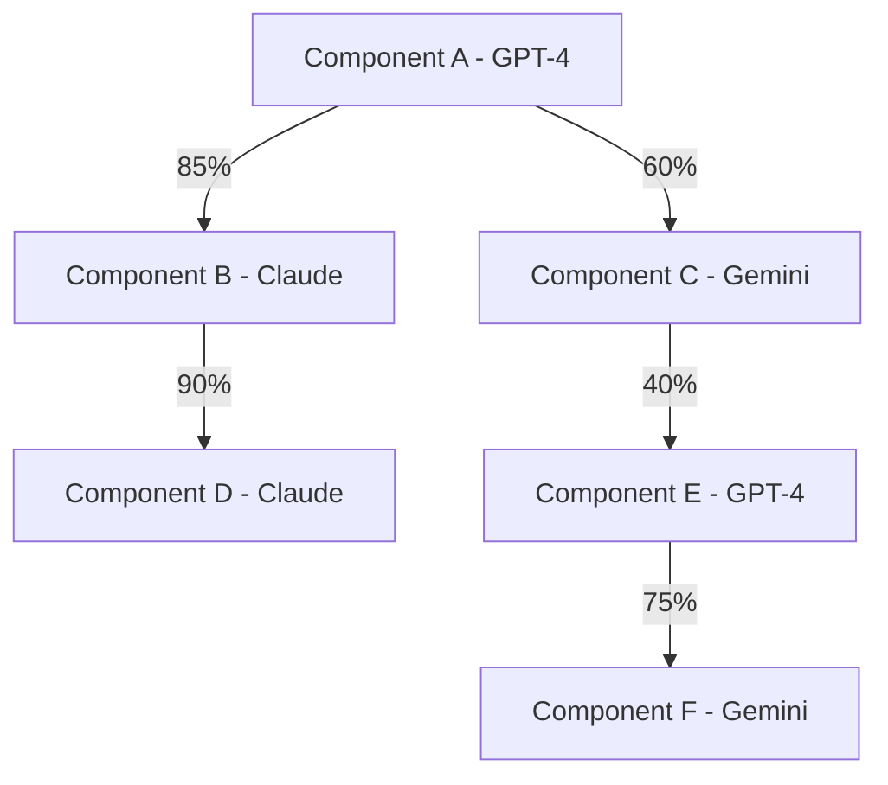
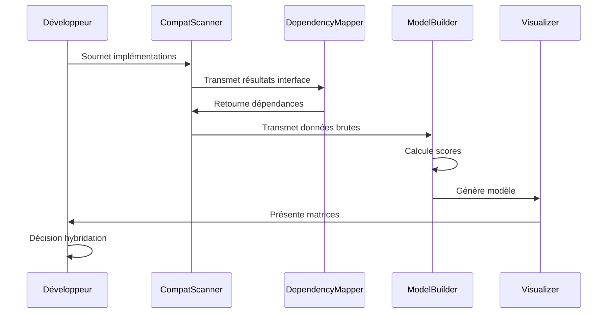

# Modèles de Matrices de Compatibilité pour Hybridation

Ce document fournit des modèles standardisés de matrices de compatibilité pour l'analyse des modules candidats à l'hybridation. Ces matrices sont issues de l'expérience du module `data_comparator` et adaptées aux spécificités des modules prioritaires.

## 1. Objectifs des Matrices de Compatibilité

Les matrices de compatibilité servent à :

1. **Évaluer l'interopérabilité** des composants de différentes implémentations
2. **Identifier les combinaisons optimales** pour l'architecture hybride
3. **Repérer les incompatibilités critiques** nécessitant des adaptateurs
4. **Quantifier les efforts d'intégration** pour chaque hybridation
5. **Tracer les décisions** de conception de manière objective

## 2. Matrice Globale de Compatibilité

### 2.1 Structure Standard

```
┌─────────────────┬────────────┬────────────┬────────────┐
│                 │ Impl. A    │ Impl. B    │ Impl. C    │
├─────────────────┼────────────┼────────────┼────────────┤
│ Implementation A│     -      │    X%      │    Y%      │
├─────────────────┼────────────┼────────────┼────────────┤
│ Implementation B│    X%      │     -      │    Z%      │
├─────────────────┼────────────┼────────────┼────────────┤
│ Implementation C│    Y%      │    Z%      │     -      │
└─────────────────┴────────────┴────────────┴────────────┘
```

### 2.2 Critères d'Évaluation de Compatibilité

| Score | Signification | Interprétation |
|-------|--------------|----------------|
| 90-100% | Haute compatibilité | Intégration directe possible |
| 70-89% | Bonne compatibilité | Adaptations mineures requises |
| 50-69% | Compatibilité moyenne | Adaptations significatives |
| 30-49% | Compatibilité faible | Refactoring majeur nécessaire |
| 0-29% | Incompatibilité | Réimplémentation recommandée |

## 3. Matrices Par Module

### 3.1 modExcelInterop - Matrice Modèle

#### 3.1.1 Matrice Composants-Implémentations

| Composant | GPT-4 | Claude | Gemini | Forces Principales |
|-----------|-------|--------|--------|-------------------|
| Architecture globale | ⭐⭐⭐ | ⭐⭐ | ⭐⭐ | GPT-4: Modularité |
| Connexion Workbooks | ⭐⭐ | ⭐⭐⭐ | ⭐⭐ | Claude: Robustesse |
| Accès cellules unitaire | ⭐⭐ | ⭐⭐ | ⭐⭐⭐ | Gemini: Performance |
| Accès plages massif | ⭐ | ⭐⭐ | ⭐⭐⭐ | Gemini: Optimisation |
| Recherche/Filtrage | ⭐⭐ | ⭐ | ⭐⭐⭐ | Gemini: Algorithmes |
| Formatage conditionnel | ⭐⭐⭐ | ⭐⭐ | ⭐ | GPT-4: Flexibilité |
| Gestion événements | ⭐⭐ | ⭐⭐⭐ | ⭐ | Claude: Fiabilité |
| Gestion erreurs | ⭐ | ⭐⭐⭐ | ⭐ | Claude: Récupération |

#### 3.1.2 Matrice Compatibilité Inter-Composants

| Composant A × Composant B | Compatibilité | Effort Intégration | Notes |
|--------------------------|---------------|-------------------|-------|
| Architecture GPT-4 × Accès massif Gemini | 65% | Moyen | Adapter interface |
| Architecture GPT-4 × Gestion erreurs Claude | 80% | Faible | Wrapper existant |
| Recherche Gemini × Formatage GPT-4 | 70% | Moyen | Conversion formats |
| Événements Claude × Architecture GPT-4 | 85% | Très faible | Compatible natif |

### 3.2 modDbInterop - Matrice Modèle

#### 3.2.1 Matrice Composants-Implémentations

| Composant | GPT-4 | Claude | Gemini | Forces Principales |
|-----------|-------|--------|--------|-------------------|
| Architecture | ⭐⭐⭐ | ⭐⭐ | ⭐⭐ | GPT-4: Abstraction |
| Factory Connexions | ⭐⭐⭐ | ⭐⭐ | ⭐⭐ | GPT-4: Extensibilité |
| Gestion Transactions | ⭐⭐ | ⭐⭐⭐ | ⭐ | Claude: Robustesse |
| Query Builder | ⭐⭐ | ⭐ | ⭐⭐⭐ | Gemini: Performance |
| Exécution requêtes | ⭐ | ⭐⭐ | ⭐⭐⭐ | Gemini: Optimisation |
| Mapping résultats | ⭐⭐⭐ | ⭐⭐ | ⭐ | GPT-4: Flexibilité |
| Connection Pooling | ⭐ | ⭐⭐ | ⭐⭐⭐ | Gemini: Efficience |
| Gestion erreurs DB | ⭐ | ⭐⭐⭐ | ⭐ | Claude: Diagnostics |

### 3.3 modLogManager - Matrice Modèle

#### 3.3.1 Matrice Composants-Implémentations

| Composant | GPT-4 | Claude | Gemini | Forces Principales |
|-----------|-------|--------|--------|-------------------|
| Architecture logger | ⭐⭐⭐ | ⭐⭐ | ⭐⭐ | GPT-4: Extensibilité |
| Rotation fichiers | ⭐⭐ | ⭐⭐⭐ | ⭐⭐ | Claude: Fiabilité |
| Formatage logs | ⭐⭐⭐ | ⭐⭐ | ⭐ | GPT-4: Flexibilité |
| Filtrage | ⭐⭐ | ⭐⭐ | ⭐⭐⭐ | Gemini: Performance |
| Écriture asynchrone | ⭐ | ⭐⭐ | ⭐⭐⭐ | Gemini: Non-bloquant |
| Garantie livraison | ⭐ | ⭐⭐⭐ | ⭐ | Claude: Fiabilité |
| Compression | ⭐⭐ | ⭐ | ⭐⭐⭐ | Gemini: Algorithmes |
| Configuration | ⭐⭐⭐ | ⭐⭐ | ⭐ | GPT-4: Adaptabilité |

### 3.4 modConfigHandler - Matrice Modèle

#### 3.4.1 Matrice Composants-Implémentations

| Composant | GPT-4 | Claude | Gemini | Forces Principales |
|-----------|-------|--------|--------|-------------------|
| Architecture configuration | ⭐⭐⭐ | ⭐⭐ | ⭐⭐ | GPT-4: Clarté |
| Validation | ⭐⭐ | ⭐⭐⭐ | ⭐ | Claude: Complétude |
| Chargement | ⭐ | ⭐⭐ | ⭐⭐⭐ | Gemini: Performance |
| Sécurisation | ⭐⭐ | ⭐⭐⭐ | ⭐ | Claude: Robustesse |
| Conversion types | ⭐⭐⭐ | ⭐⭐ | ⭐⭐ | GPT-4: Généricité |
| Changements dynamiques | ⭐⭐ | ⭐ | ⭐⭐⭐ | Gemini: Réactivité |
| Stratégies fallback | ⭐ | ⭐⭐⭐ | ⭐ | Claude: Fiabilité |
| Cache | ⭐ | ⭐⭐ | ⭐⭐⭐ | Gemini: Performance |

## 4. Processus d'Analyse de Compatibilité

### 4.1 Méthodologie d'Évaluation

1. **Décomposition** - Segmenter chaque module en composants fonctionnels
2. **Analyse indépendante** - Evaluer chaque implémentation sur ses mérites propres
3. **Évaluation croisée** - Déterminer compatibilité entre implémentations diverses
4. **Scoring** - Noter objectivement selon critères prédéfinis
5. **Validation** - Tests d'intégration sur prototypes pour confirmer compatibilité

### 4.2 Critères d'Évaluation Détaillés

| Aspect | Critères d'Évaluation | Pondération |
|--------|----------------------|-------------|
| Interface | Signature méthodes, types retour, conventions | 20% |
| Dépendances | Couplage, dépendances externes | 15% |
| Architecture | Patterns, séparation responsabilités | 25% |
| Performances | Complexité algorithmique, utilisation ressources | 20% |
| Robustesse | Gestion erreurs, cas limites | 15% |
| Extensibilité | Facilité extension, adaptabilité | 5% |

### 4.3 Formulaire de Compatibilité Composant

Pour chaque paire de composants évalués:

```
Composant Source: [Nom] de [Implémentation]
Composant Cible: [Nom] de [Implémentation]

Compatibilité Interface: [0-100%]
Commentaire: 

Compatibilité Dépendances: [0-100%]
Commentaire:

Compatibilité Architecturale: [0-100%]
Commentaire:

Compatibilité Performance: [0-100%]
Commentaire:

Compatibilité Robustesse: [0-100%]
Commentaire:

Score Global: [0-100%]

Effort d'Intégration Estimé: [Très Faible/Faible/Moyen/Élevé/Très Élevé]

Recommandation: [Intégration Directe/Adaptateur/Wrapper/Refactoring/Réimplémentation]
```

## 5. Visualisation des Résultats

### 5.1 Heat Map de Compatibilité

Utiliser une représentation visuelle type "heat map" pour visualiser rapidement les niveaux de compatibilité:

```
┌─────────────┬──────────────────────────────────────────────────────┐
│             │              Implementation Cible                     │
│             ├──────────┬──────────┬──────────┬──────────┬──────────┤
│ Impl.Source │ Comp. A  │ Comp. B  │ Comp. C  │ Comp. D  │ Comp. E  │
├─────────────┼──────────┼──────────┼──────────┼──────────┼──────────┤
│ Comp. A     │    -     │   🟢     │   🟡     │   🔴     │   🟢     │
├─────────────┼──────────┼──────────┼──────────┼──────────┼──────────┤
│ Comp. B     │   🟡     │    -     │   🟢     │   🟡     │   🟡     │
├─────────────┼──────────┼──────────┼──────────┼──────────┼──────────┤
│ Comp. C     │   🟢     │   🟡     │    -     │   🟢     │   🔴     │
├─────────────┼──────────┼──────────┼──────────┼──────────┼──────────┤
│ Comp. D     │   🔴     │   🟡     │   🟢     │    -     │   🟡     │
├─────────────┼──────────┼──────────┼──────────┼──────────┼──────────┤
│ Comp. E     │   🟢     │   🟢     │   🔴     │   🟡     │    -     │
└─────────────┴──────────┴──────────┴──────────┴──────────┴──────────┘
```

Légende:
- 🟢 Haute compatibilité (80-100%)
- 🟡 Compatibilité moyenne (50-79%)
- 🔴 Faible compatibilité (0-49%)

### 5.2 Graphe de Dépendances

Utiliser un graphe dirigé pour visualiser les relations entre composants et implémentations:



## 6. Automatisation de l'Analyse

### 6.1 Outils d'Analyse

Des outils spécifiques sont en cours de développement pour faciliter l'analyse de compatibilité:

1. **CompatScanner** - Analyse statique du code pour détecter incompatibilités d'interface
2. **DependencyMapper** - Cartographie des dépendances pour évaluer risques d'intégration
3. **ArchitectureAnalyzer** - Évaluation de conformité des patterns architecturaux
4. **PerformanceBenchmark** - Comparaison objective performances sur scénarios standards

### 6.2 Workflow d'Analyse



## 7. Application aux Modules Prioritaires

### 7.1 Guide d'Application pour modExcelInterop

1. Identifier les composants critiques pour les opérations sur grands volumes
2. Analyser particulièrement la compatibilité entre architecture (GPT-4) et routines optimisées (Gemini)
3. Évaluer les mécanismes de récupération d'erreurs de Claude en contexte Excel
4. Se concentrer sur les opérations de recherche et filtrage pour l'optimisation

### 7.2 Guide d'Application pour modDbInterop

1. Analyser l'intégration entre Factory (GPT-4) et Pooling (Gemini)
2. Évaluer la compatibilité des mécanismes transactionnels de Claude avec l'architecture GPT-4
3. Mesurer la complexité d'intégration du Query Builder Gemini
4. Vérifier la cohérence des mécanismes de récupération d'erreur

### 7.3 Guide d'Application pour modLogManager

1. Focus sur compatibilité architecture extensible (GPT-4) et mécanismes asynchrones (Gemini)
2. Évaluer l'intégration des garanties de livraison Claude
3. Analyser la compatibilité des mécanismes de compression Gemini
4. Vérifier la cohérence des mécanismes de configuration pour tous les composants

### 7.4 Guide d'Application pour modConfigHandler

1. Analyser l'intégration validation Claude avec l'architecture GPT-4
2. Évaluer les mécanismes de chargement optimisé Gemini
3. Vérifier compatibilité des stratégies fallback Claude
4. Analyser l'intégration des mécanismes de cache Gemini

## 8. Conclusion

Les matrices de compatibilité constituent un outil essentiel pour une approche méthodique et objective de l'hybridation. En suivant ces modèles et cette méthodologie, les équipes pourront:

1. Réduire le temps d'analyse préliminaire
2. Améliorer la qualité des décisions d'architecture
3. Minimiser les risques d'incompatibilité 
4. Maximiser les bénéfices de l'hybridation
5. Documenter efficacement les choix de conception

Pour chaque module candidat, l'adaptation de ces matrices aux spécificités du domaine permettra d'identifier rapidement les opportunités d'hybridation optimales.

---

*Document créé le 2025-07-04*  
*Auteur: Équipe d'Architecture APEX*  
*Version: 1.0* 