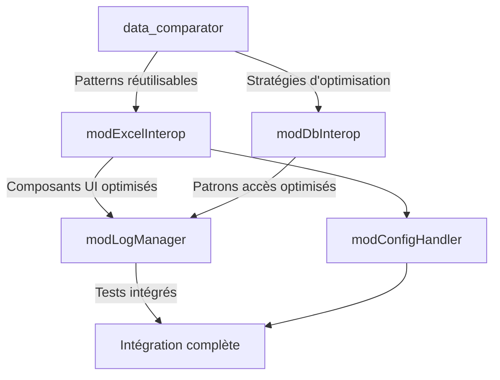

# Plan d'Hybridation des Modules APEX Framework

## 1. Vue d'Ensemble

Suite au succès de l'hybridation du module `data_comparator`, ce document présente la stratégie d'hybridation pour les prochains modules candidats identifiés. Cette approche méthodique vise à optimiser les performances, la robustesse et la maintenabilité des composants critiques du framework APEX.

### 1.1 Modules Candidats Prioritaires

| Module | Rôle | Priorité | Complexité | Gains Attendus |
|--------|------|----------|------------|----------------|
| **modExcelInterop** | Interface Excel | ⭐⭐⭐ | Élevée | Performance (volumes) |
| **modDbInterop** | Accès base de données | ⭐⭐⭐ | Élevée | Robustesse + Performance |
| **modLogManager** | Journalisation | ⭐⭐ | Moyenne | Performance intensive |
| **modConfigHandler** | Gestion configuration | ⭐⭐ | Moyenne | Chargement config complexe |

### 1.2 Critères de Priorisation

1. **Impact sur les performances système** - Modules critiques dans les chemins d'exécution fréquents
2. **Complexité algorithmique** - Composants avec trade-offs entre performance et lisibilité
3. **Volumes de données** - Manipulation de grands volumes fréquente
4. **Maturité des implémentations** - Existence de multiples implémentations à comparer
5. **Dépendances** - Minimisation des dépendances croisées pour l'hybridation

## 2. Calendrier d'Hybridation

### 2.1 Planning et Jalons

| Phase | Module | Période | Livrables Clés |
|-------|--------|---------|--------------|
| **Phase 1** | modExcelInterop | Q3 2025 | Analyse comparative, Matrice compatibilité, MVP hybride |
| **Phase 2** | modDbInterop | Q4 2025 | Analyse, Matrice, Architecture hybride |
| **Phase 3** | modLogManager + modConfigHandler | Q1 2026 | Analyse simultanée, Hybridation parallèle |
| **Phase 4** | Intégration complète | Q2 2026 | Tests système, Validation finale |

### 2.2 Dépendances Inter-Modules

## 3. Méthodologie par Module

### 3.1 modExcelInterop

#### 3.1.1 Enjeux Spécifiques

- Manipulation de grands volumes de données (>100K cellules)
- Opérations intensives (recherche, filtrage, mise en forme conditionnelle)
- Besoin de performances et d'économie mémoire
- Compatibilité multi-versions Excel

#### 3.1.2 Approche d'Hybridation

1. **Analyse des implémentations existantes**
   - GPT-4: Architecture claire, extensible
   - Claude: Robustesse, récupération erreurs
   - Gemini: Performances optimales, vectorisation

2. **Stratégie d'hybridation**
   - Conserver architecture modulaire (GPT-4)
   - Intégrer routines performance-critique (Gemini)
   - Ajouter couche récupération erreurs (Claude)
   - Implémenter sélection stratégie selon volume

3. **Points critiques**
   - Gestion mémoire optimisée pour grands tableaux
   - Routines de recherche/filtrage hyper-optimisées
   - Découpage intelligent pour volumes extrêmes
   - Mise en cache adaptative

#### 3.1.3 Plan de Tests Dédié

| Type Test | Focus | Volumétrie | KPI Cible |
|-----------|-------|------------|-----------|
| Unitaire | Fonctions atomiques | 1-1000 cellules | Couverture >95% |
| Intégration | Chaînes opérations | 1K-10K cellules | Stabilité 100% |
| Performance | Opérations critiques | 100K-1M cellules | +25% vs meilleure implémentation |
| Robustesse | Récupération erreurs | N/A | >92% récupération |
| Charge | Limites système | >2M cellules | Dépassement gracieux |

### 3.2 modDbInterop

#### 3.2.1 Enjeux Spécifiques

- Requêtes complexes optimisées
- Transactions robustes multi-sources
- Résistance aux erreurs réseau/base de données
- Support multiple drivers (ADO, ODBC, natifs)

#### 3.2.2 Approche d'Hybridation

1. **Analyse comparative**
   - GPT-4: Architecture claire, abstraction élevée
   - Claude: Gestion transactions robuste, récupération
   - Gemini: Performance, pooling connections

2. **Stratégie d'hybridation**
   - Base architecturale GPT-4
   - Mécanismes transaction/rollback Claude
   - Optimisations query/connection pooling Gemini
   - Stratégie adaptive selon charge et criticité

3. **Points critiques**
   - Query Building optimisé
   - Gestion ressources connections
   - Transactions distribuées
   - Retry intelligents

#### 3.2.3 Plan de Tests Spécifiques

| Scénario | Complexité | Volume | Métrique |
|----------|------------|--------|----------|
| Requêtes simples | Basse | 1-1000 records | Latence <10ms |
| Jointures complexes | Moyenne | 1K-50K records | Optimisation plans +30% |
| Transactions | Élevée | Variable | Intégrité 100% |
| Récupération erreurs | Critique | N/A | Taux >90% |
| Charge parallèle | Extrême | 100K+ | Dégradation gracieuse |

### 3.3 modLogManager

#### 3.3.1 Spécificités

- Journalisation haute fréquence
- Multiples destinations (fichier, DB, réseau)
- Filtrage dynamique
- Rotation/compression logs

#### 3.3.2 Approche d'Hybridation

1. **Analyse**
   - GPT-4: Architecture extensible
   - Claude: Fiabilité, non-perte
   - Gemini: Performance, write batching

2. **Stratégie**
   - Architecture extensible GPT-4
   - Mécanismes garantie Claude
   - Optimisation I/O batch Gemini

3. **Points critiques**
   - Bufferisation intelligente
   - Compression à la volée
   - Stratégies rotation selon contexte

### 3.4 modConfigHandler

#### 3.4.1 Spécificités

- Configuration multi-source
- Validation complexe
- Changements dynamiques
- Sécurisation/chiffrement

#### 3.4.2 Approche d'Hybridation

1. **Analyse**
   - GPT-4: Modèle objet clair
   - Claude: Validation robuste
   - Gemini: Chargement performances

2. **Stratégie**
   - Architecture objet GPT-4
   - Validation Claude
   - Chargement/cache Gemini

## 4. Ressources et Organisation

### 4.1 Équipe Hybridation

| Rôle | Responsabilité | Allocation |
|------|----------------|------------|
| Architecte hybridation | Conception patterns | 50% |
| Spécialiste performance | Benchmark, optimisation | 70% |
| Expert domaine module | Validation fonctionnelle | 40% |
| Testeur spécialisé | Framework test hybridation | 100% |
| Responsable documentation | Capitalisation | 30% |

### 4.2 Infrastructure

- Environnement dédié hybridation
- Outils benchmark automatisés
- CI/CD spécifique modules hybrides
- Tableau de bord performance en temps réel

### 4.3 Outils et Accélérateurs

| Outil | Rôle | Avantage |
|-------|------|----------|
| Matrice compatibilité auto | Analyse compatibilité | Accélération 50% analyse |
| Générateur tests hybrides | Tests automatiques hybridation | Couverture garantie |
| Visualisateur performances | Comparaison graphique | Identification points chauds |
| Bibliothèque patterns | Réutilisation | Standardisation approche |

## 5. Gestion des Risques

### 5.1 Risques Identifiés

| Risque | Impact | Probabilité | Mitigation |
|--------|--------|-------------|------------|
| Incompatibilité architecturale | Élevé | Moyenne | Couche adaptation, design patterns |
| Régression fonctionnelle | Élevé | Faible | Tests exhaustifs pré-hybridation |
| Performances inférieures | Moyen | Faible | Benchmarks systématiques |
| Complexité maintenance | Moyen | Moyenne | Documentation avancée, training |
| Dépendances externes | Moyen | Moyenne | Isolation, abstractions |

### 5.2 Plan de Contingence

Pour chaque module, une version de fallback sera conservée et maintenue en parallèle pendant une période de 3 mois suivant l'hybridation, permettant un rollback rapide si nécessaire.

## 6. Métriques de Succès

### 6.1 KPIs Globaux

| Métrique | Base | Cible | Méthode Mesure |
|----------|------|-------|----------------|
| Performance globale | Base actuelle | +20% minimum | Benchmark suite |
| Consommation mémoire | Base actuelle | -15% | Profilage |
| Robustesse | Taux récupération | +10% | Tests chaos |
| Maintenabilité | Complexité cyclomatique | Stable ou améliorée | Analyse statique |
| Couverture tests | Actuelle | >90% | Rapports couverture |

### 6.2 Revues et Validations

- Revue architecture pré-hybridation
- Validation performance post-MVP
- Revue sécurité (si applicable)
- Validation fonctionnelle complète
- Approbation comité architecture

## 7. Bonnes Pratiques Issues de data_comparator

Basées sur l'expérience réussie de l'hybridation de `data_comparator`, les pratiques suivantes seront systématiquement appliquées :

1. **Commencer par l'architecture** - Privilégier la meilleure base architecturale
2. **Analyser objectivement** - Utiliser métriques quantifiables pour toute décision
3. **Tester incrémentalement** - Valider chaque composant hybridé avant intégration
4. **Documenter les choix** - Tracer décisions, alternatives, raisons
5. **Appliquer hybridation adaptative** - Permettre sélection stratégie selon contexte

## 8. Livrables et Documentation

Pour chaque module hybridé, les livrables suivants seront produits :

1. **Analyse comparative** des implémentations originales
2. **Matrice de compatibilité** détaillée par composant
3. **Architecture hybride** documentée avec diagrammes
4. **Suite de tests** complète avec scénarios spécifiques
5. **Guide d'implémentation** pour développeurs
6. **Rapport de performance** avant/après hybridation
7. **Documentation technique** complète du module hybride
8. **Guide de maintenance** avec patterns et bonnes pratiques

## 9. Conclusion

Ce plan d'hybridation systématique des modules clés du framework APEX s'appuie sur l'expérience réussie du module `data_comparator` pour accélérer et standardiser l'optimisation des composants critiques. L'approche méthodique, combinée aux outils et patterns développés, permettra de maximiser les gains tout en minimisant les risques.

La capitalisation continue des connaissances et l'amélioration des pratiques d'hybridation au fil des modules constitueront un actif stratégique pour l'évolution du framework APEX.

---

*Document créé le 2025-07-04*  
*Auteur: Équipe d'Architecture APEX*  
*Validé par: Comité Technique APEX*  
*Version: 1.0* 